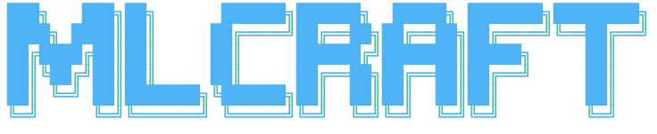

<div align="center">



<h3>Research-first AI/ML engineering for your AI coding assistant</h3>

<p><i>Reads the papers, picks the best method, and evaluates honestly with no data leakage and no inflated numbers.</i></p>

<p>


</p>

<p><b><a href="#install">Install</a></b> &nbsp;|&nbsp; <b><a href="#examples">Examples</a></b> &nbsp;|&nbsp; <b><a href="#components">Skills</a></b> &nbsp;|&nbsp; <b><a href="#what-it-does-automatically">How it works</a></b></p>

</div>

An AI/ML engineering plugin that makes your AI coding assistant work like a senior AI/ML research engineer. It researches papers first, picks the best method for your problem, trains and fine-tunes rigorously, evaluates honestly with no data leakage and no inflated numbers, and iteratively pushes accuracy toward the realistic ceiling. It works across computer vision, medical imaging, NLP and LLM, tabular, time-series, audio and speech, recommendation, generative models, reinforcement learning, graph, multimodal, video, 3D, and anomaly detection.

## What it does automatically

When you describe an ML task, the assistant auto-invokes the right skills:

- "detect vehicles, faces, or objects in images" goes to domain-computer-vision
- "classify brain tumor MRI or benign vs malignant mammogram" goes to domain-medical-imaging
- "predict churn, fraud, or price from this CSV" goes to domain-tabular
- "forecast demand or sales" goes to domain-time-series
- "classify text, build a RAG chatbot, or fine-tune an LLM" goes to domain-nlp-llm
- "build a recommendation system" goes to domain-recommender
- "speech to text or audio classification" goes to domain-audio-speech
- "generate or edit images with diffusion" goes to domain-generative
- "recognize actions in video" goes to domain-video
- "detect anomalies or defects" goes to domain-anomaly-detection
- "accuracy is still too low, improve it" goes to accuracy-improvement-loop

The orchestrator skill (ml-research-methodology) runs the full pipeline: framing, literature review, data-leakage audit, method selection, honest baselines, training, rigorous evaluation, and deployment with explainability.

It also detects whether you want a Kaggle notebook, a Google Colab notebook, or a local GPU run, and adapts the deliverable. Generated notebooks use short simple explanations in a professional research tone, with no em-dash and no emoji.

## Requirements

- A supported agent harness: Claude Code or Antigravity today. Codex, Cursor, and more coming soon.
- Git, to clone or add the plugin from a repository.

## Install

### From Claude Desktop or the web app 

1. Open Settings.
2. Go to Plugins.
3. Click Add, then Add marketplace.
4. Choose Add from a repository.
5. Paste the GitHub repository: `mxslr/mlcraft` (or the full URL `https://github.com/mxslr/mlcraft`).
6. After the marketplace is added, find mlcraft in the plugin list and click Install.

### From Claude Code (CLI)

```
/plugin marketplace add mxslr/mlcraft
/plugin install mlcraft@mlcraft-marketplace
```

The first command registers the marketplace defined in this repository. The second installs the plugin named mlcraft from the marketplace named mlcraft-marketplace.

### From a local folder 

From the directory that contains the cloned repository:

```
/plugin marketplace add ./mlcraft
/plugin install mlcraft@mlcraft-marketplace
```

After installing, restart or reload Claude Code so the skills are picked up. Verify with /plugin and confirm the plugin appears as enabled.

## Use

- Automatic: describe your task in chat and the skills trigger themselves.
- Explicit: run /ml-project followed by your task, dataset, and goal metric.

## Examples

### 1. Medical imaging, delivered as a Kaggle notebook

You say: "I have a brain tumor MRI dataset. Classify tumor vs no tumor. I want a Kaggle notebook."

The plugin will: research the realistic accuracy ceiling for this task, build a patient-level split with leakage checks, pick a suitable backbone such as EfficientNet or ConvNeXt with the right medical preprocessing, train honest baselines first, report sensitivity and specificity at a clinical threshold, add Grad-CAM overlays, and write a Kaggle notebook with short professional explanations, no em-dash, and no emoji.

### 2. Object detection on a local GPU

You say: "Detect vehicles and license plates in traffic images. I will run it on my own GPU."

The plugin will: route to computer vision, recommend a detector such as YOLO or RT-DETR, split by scene so frames of the same scene do not leak across train and test, size resolution and batch to your local VRAM, evaluate with mAP at the right IoU, and package an inference function.

### 3. Improve a model that is stuck

You say: "My classifier is stuck at 68 percent. Make it better."

The plugin will: run the accuracy-improvement loop. It re-audits for data leakage first, reads the learning curves to tell overfitting from underfitting, inspects saliency maps to check the model is looking at the signal and not an artifact, researches the specific gap, then proposes a ranked, principled combination of techniques with an honest ceiling rather than a magic promise.

## Other harnesses

### Antigravity

Antigravity installs plugins straight from a Git repository:

```
agy plugin install https://github.com/mxslr/mlcraft
```

### Codex, Cursor, and more

Coming soon. The skills are portable Markdown, so bringing the plugin to other agent harnesses is on the roadmap.

## Publish to GitHub 

Run these from inside the plugin folder.

The gh CLI is the easiest path. If you do not have it, install it from https://cli.github.com then run:

```
git init
git add .
git commit -m "mlcraft plugin"
gh auth login
gh repo create mlcraft --public --source=. --remote=origin --push
```

Without gh, create an empty repository named mlcraft on github.com first, then run:

```
git init
git add .
git commit -m "mlcraft plugin"
git branch -M main
git remote add origin https://github.com/mxslr/mlcraft.git
git push -u origin main
```

## Components

| Type | Name | Purpose |
|---|---|---|
| command | /ml-project | Entry point for the full workflow |
| agent | paper-researcher | Read-only literature brief: SOTA, realistic ceiling, leakage traps |
| skill | ml-research-methodology | Orchestrator and routing table |
| skill | notebook-delivery | Detect Kaggle vs Colab vs local GPU, enforce notebook style |
| skill | literature-review | Find and critically appraise papers |
| skill | data-rigor-and-leakage | Correct splits and leakage hunt |
| skill | training-optimization | Fine-tuning recipe, anti-overfit, GPU budget |
| skill | rigorous-evaluation | Right metrics, calibration, thresholds chosen on validation |
| skill | deployment-explainability | Inference parity, per-problem explainability, guardrails |
| skill | accuracy-improvement-loop | Diagnose, research the gap, combine techniques |
| skill | domain-computer-vision | CV model selection |
| skill | domain-medical-imaging | Medical rigor and model selection |
| skill | domain-nlp-llm | NLP, LLM, and RAG method selection |
| skill | domain-tabular | Tabular model selection |
| skill | domain-time-series | Forecasting, classification, anomaly detection |
| skill | domain-audio-speech | ASR, audio classification, speaker, keyword spotting |
| skill | domain-recommender | Retrieve-then-rank, sequential, temporal splits |
| skill | domain-generative | Diffusion vs GAN, LoRA/DreamBooth, FID/CLIP eval |
| skill | domain-reinforcement-learning | PPO/SAC/DQN, offline RL, multi-seed eval |
| skill | domain-graph | GNNs, transductive vs inductive splits, GNNExplainer |
| skill | domain-multimodal | CLIP/BLIP-2/LLaVA, retrieval, VQA, captioning |
| skill | domain-video | VideoMAE/Video Swin, video-level split, mAP/accuracy |
| skill | domain-3d | Point Transformer v3, sparse conv, mIoU/mAP, scene split |
| skill | domain-anomaly-detection | PatchCore/EfficientAD, one-class, PR-AUC, honest metrics |

## Design principle

Honesty over inflated numbers. A valid, reproducible 0.82 AUC beats a leaky 0.99. The plugin's core value is knowing which numbers are real, which are inflated by ROI-cropping or data leakage, and when a model has reached its realistic ceiling.
